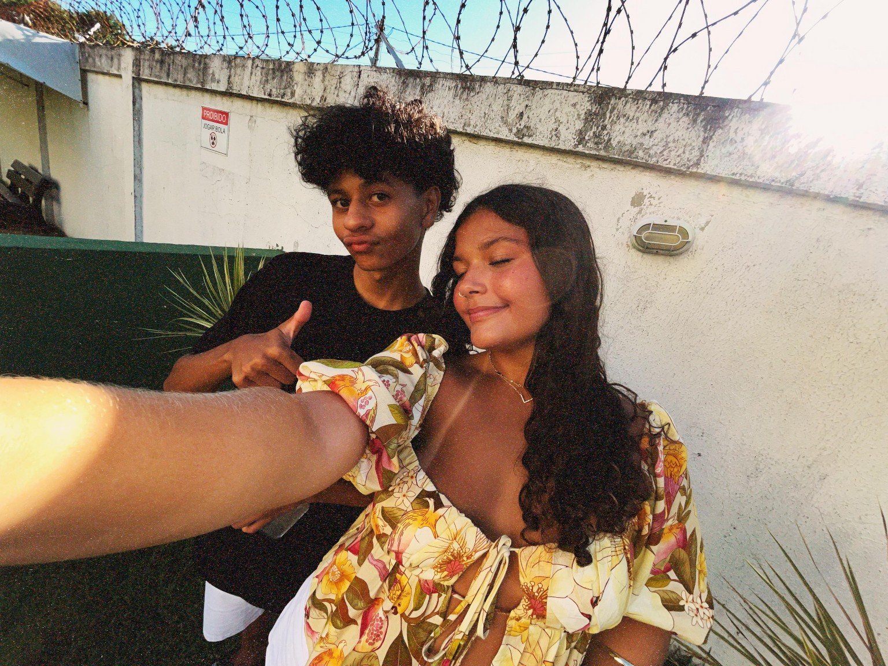
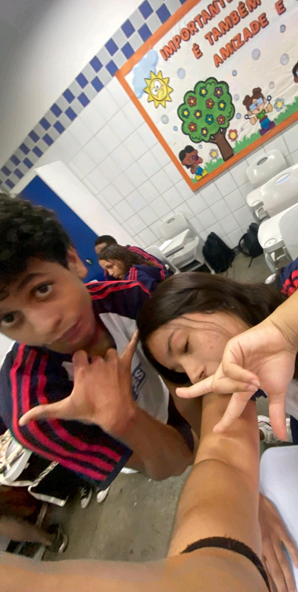
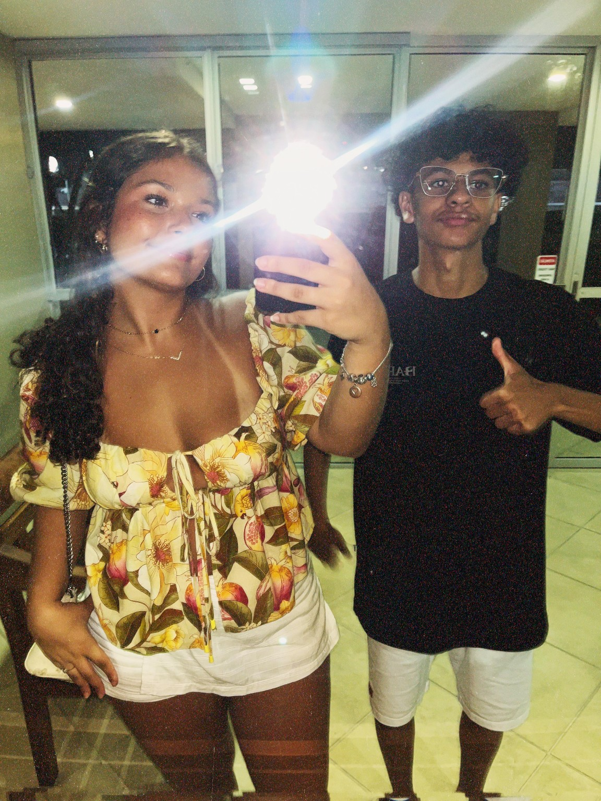
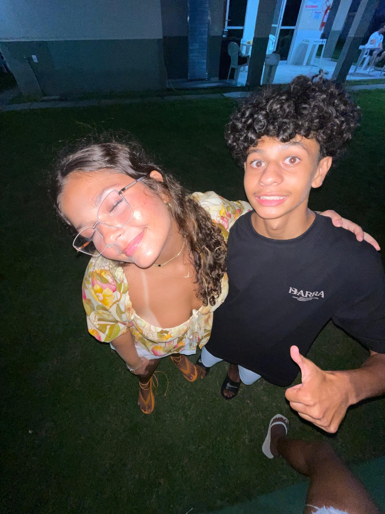
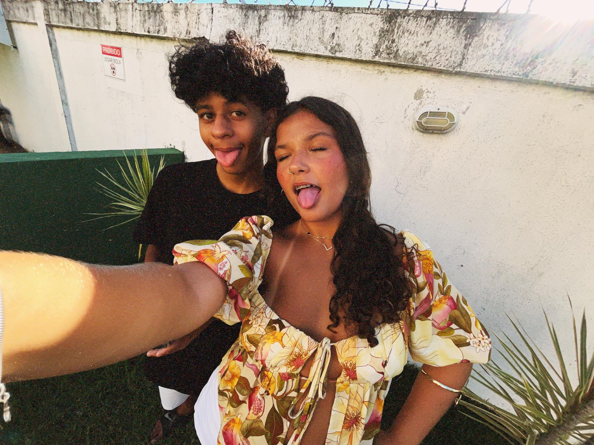

<title>Para Júlia 💖</title>
  
</head>
<body>

  

  <header>
    <h1>Para Júlia 💖</h1>
    
Uma mensagem feita com carinho, só pra você

  </header>

<section class="intro">
    
Tem algo que eu preciso te contar, e guardei isso com muito carinho...

    <button onclick="mostrarDeclaracao()">Clique para começar</button>
    

      

Júlia,

A gente se aproximou, riu, trocou segredos, histórias...
E cada pedacinho seu foi ficando aqui, no meu coração.

E com o tempo, percebi que era mais do que amizade.
Eu me apaixonei por você.

Foi natural, foi sincero, foi real.
E hoje, eu só queria te contar isso, sem pressa, sem cobrança.

Só queria que você soubesse.

Com carinho,  
Gabriel Alves 💖
      

    

  </section>

  <section class="motivos">
    <h2>Motivos pelos quais eu gosto de você</h2>
    <ul>
      <li>Seu sorriso que ilumina qualquer lugar</li>
      <li>Seu jeito carinhoso de cuidar dos outros</li>
      <li>As conversas que me fazem esquecer do mundo</li>
      <li>O jeito como você é verdadeira, sempre</li>
      <li>Porque com você, tudo é mais leve</li>
    </ul>
  </section>

  <section class="frases">
    
“Com você, até o silêncio tem significado.”

  </section>

  <section class="galeria">
    
    
    
    
    
    
  </section>

  <section class="frases">
    
“Você me faz querer ser alguém melhor todos os dias.”

    
“A vida sorriu pra mim quando colocou você no meu caminho.”

  </section>

  

    Feito com 💖 por Gabriel Alves — 2025
  

  

</body>
</html>
<!-- Música: Pupila -->
  

    <iframe width="0" height="0"
      src="https://www.youtube.com/embed/937mq8wUmRI?autoplay=1&loop=1&playlist=937mq8wUmRI"
      frameborder="0" allow="autoplay">
